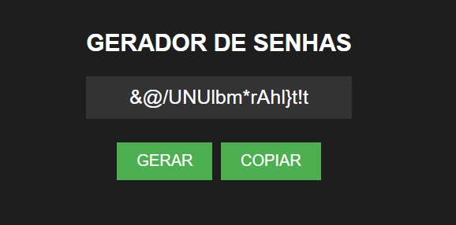

# GERADOR DE SENHAS
🔵GERE SENHAS ALEATÓRIAS ENTRE 8 E 20 CARACTERES! 

 <br>
 <br>

## DESCRIÇÃO E RECURSOS:
O "Gerador de Senhas" é uma ferramenta simples e eficiente para criar senhas aleatórias com combinações de letras, números e caracteres especiais. Com um design responsivo e escuro, oferece uma experiência amigável ao usuário.

1. **Geração Aleatória de Senhas:** Gera senhas com comprimento variável de 8 a 20 caracteres, garantindo segurança e diversidade.
2. **Botão Gerar:** Clique no botão "GERAR" para obter uma nova senha sempre que necessário.
3. **Campo Oculto para Senha:** Inicialmente oculta, a senha gerada é revelada somente após o clique no botão "GERAR".
4. **Botão Copiar:** Após a geração da senha, o botão "COPIAR" é ativado, permitindo que você copie a senha para a área de transferência.
5. **Mensagem de Confirmação:** Ao clicar em "COPIAR", uma mensagem informa que a senha foi copiada para a área de transferência. Esta mensagem desaparece após 3 segundos.
  
Utilize este aplicativo sempre que precisar de uma senha segura e aleatória para suas contas online, garantindo a segurança de suas informações.

## COMO USAR?
### BAIXANDO O PROJETO:
* Clone o repositório para o seu sistema local:

```bash
git clone https://github.com/VILHALVA/GERADOR-DE-SENHAS.git
```

* Navegue até o diretório do projeto.

```bash
cd GERADOR-DE-SENHAS
```

* Descompacte o arquivo ZIP (se você baixou manualmente):

```bash
unzip GERADOR-DE-SENHAS.zip
```
* Abra o arquivo `CODIGO.html` em seu navegador de preferência.

### EXECUTANDO O PROJETO:
1. Abra o aplicativo "Gerador de Senhas" em seu navegador.
2. Clique no botão "GERAR" para obter uma nova senha.
3. Após a geração da senha, ela será exibida no campo designado.
4. O botão "COPIAR" estará agora disponível. Clique nele para copiar a senha.
5. Uma mensagem será exibida abaixo, confirmando que a senha foi copiada.
6. A senha gerada será apagada automaticamente do campo após a cópia.

## NÃO SABE?
- Entendemos que para manipular arquivos em `HTML`, `CSS` e outras linguagens relacionadas, é necessário possuir conhecimento nessas áreas. Para auxiliar nesse aprendizado, oferecemos cursos gratuitos disponíveis:
* [Curso de HTML e CSS](https://github.com/VILHALVA/CURSO-DE-HTML-E-CSS)
* [Curso de JavaScript](https://github.com/VILHALVA/CURSO-DE-JAVASCRIPT)
* [Confira mais cursos](https://github.com/VILHALVA?tab=repositories&q=+topic:CURSO)

## CREDITOS:
- [PROJETO CRIADO PELO VILHALVA](https://github.com/VILHALVA)
- [ESTÁ DISPONIVEL NO SITE](https://vilhalva.github.io/STYLER/STYLER.html)

